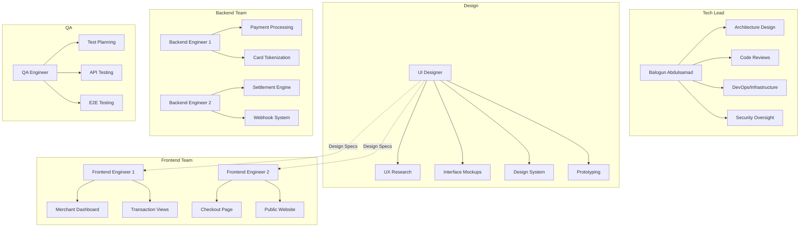
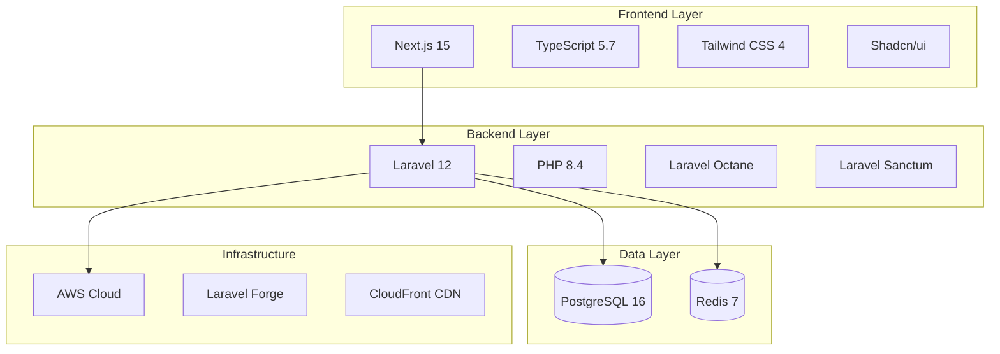
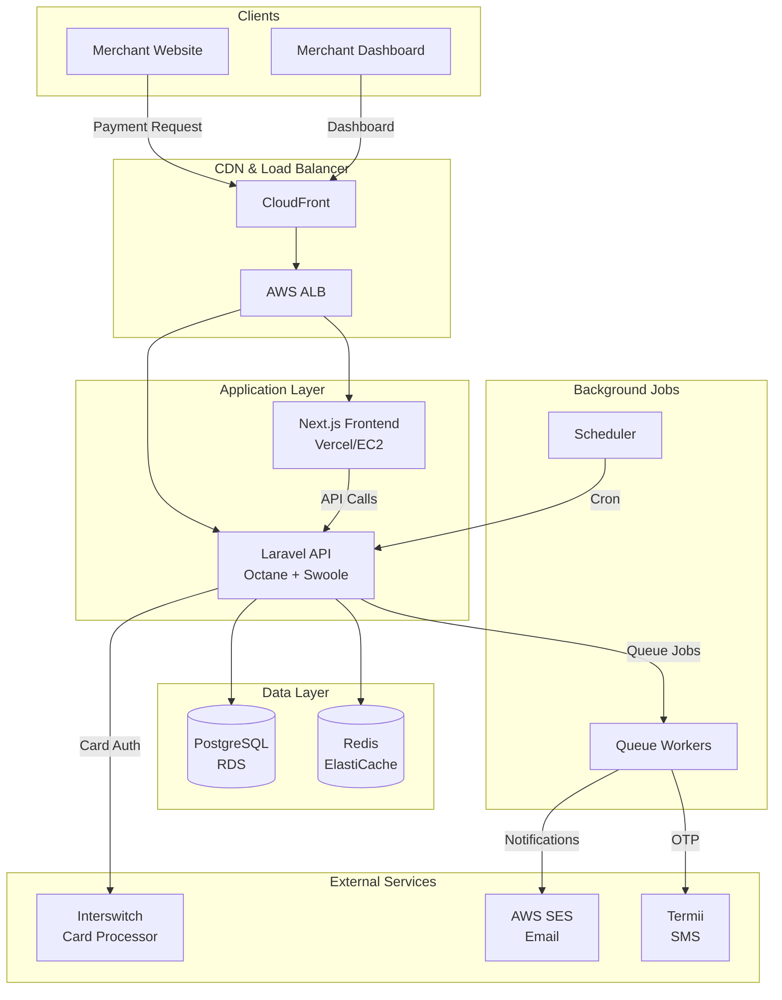
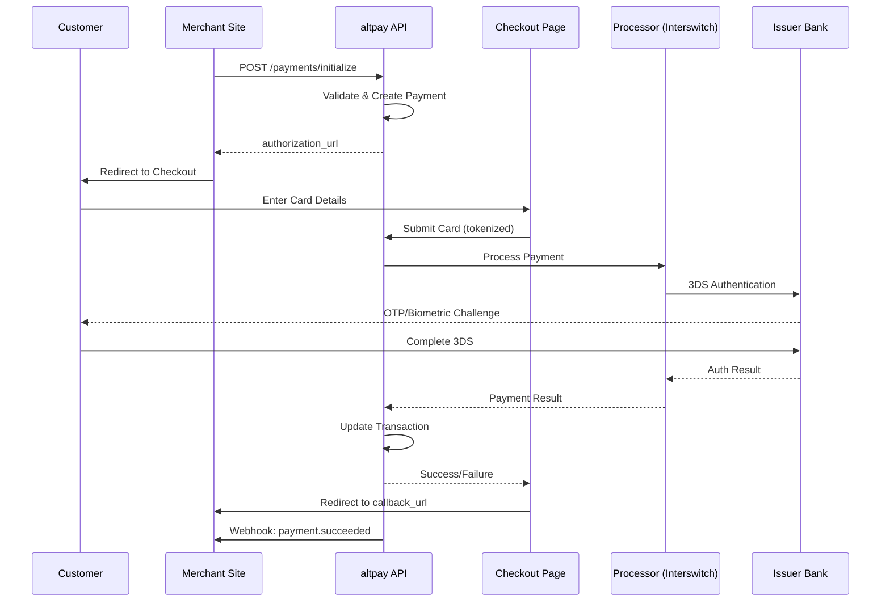
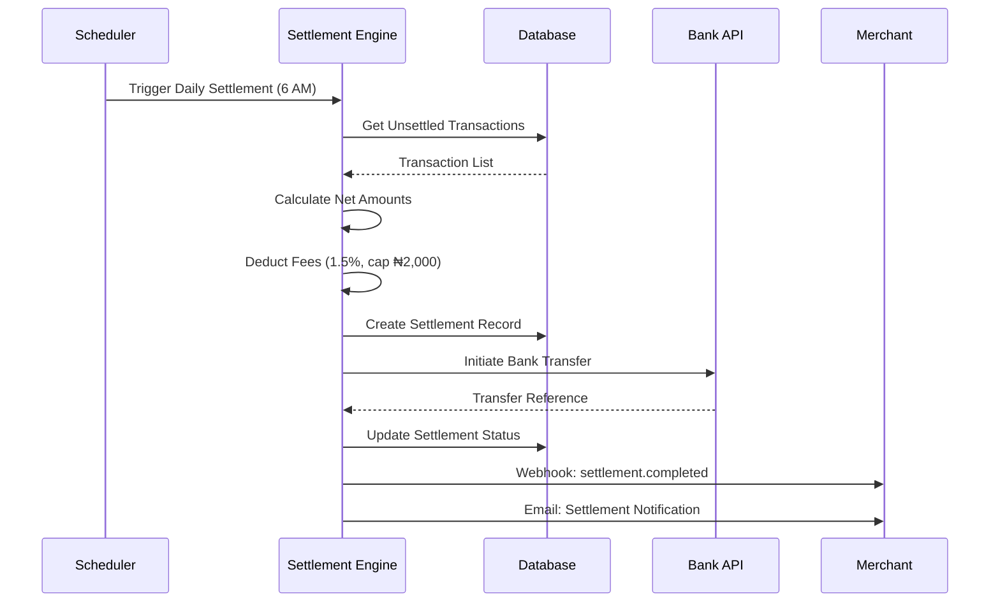
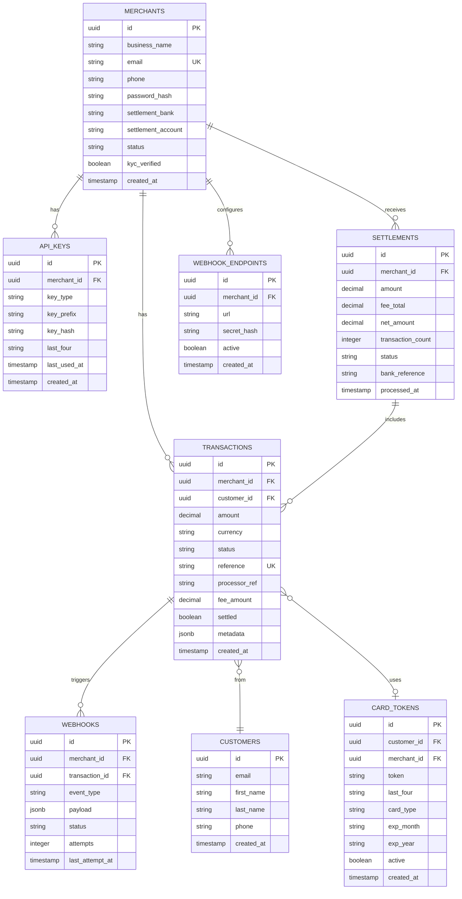
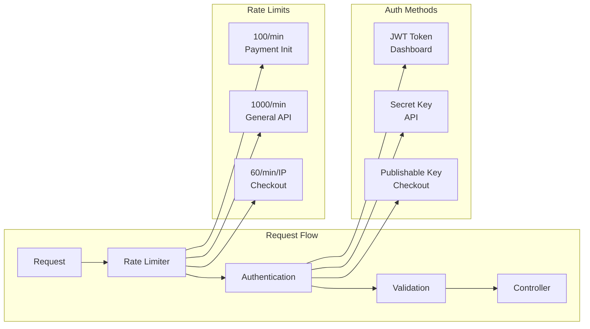
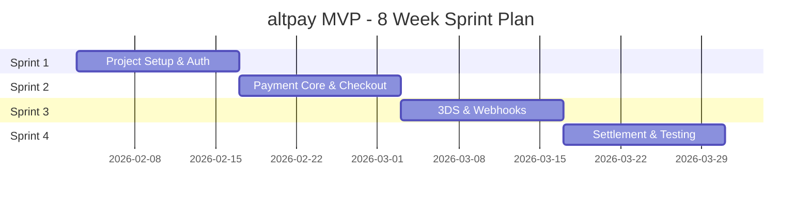
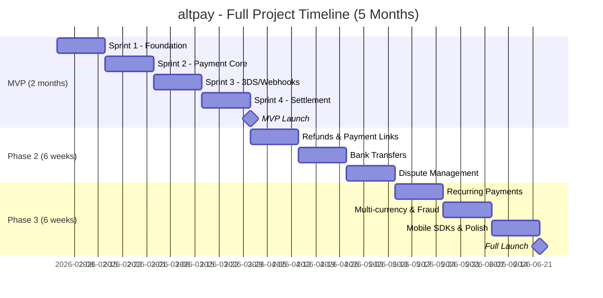

# MVP Specification Document
## altpay - Nigerian Payment Gateway

---

## Document Information

| Field | Details |
|-------|---------|
| **Project Name** | altpay Payment Gateway |
| **Document Type** | MVP (Minimum Viable Product) Specification |
| **Version** | 1.0 |
| **Date** | January 30, 2026 |
| **Author** | Balogun Abdulsamad (Engineering Team Lead) |
| **Status** | Draft |
| **MVP Duration** | 8 Weeks (2 Months) |

---

## Table of Contents
1. [Executive Summary](#1-executive-summary)
2. [MVP Scope](#2-mvp-scope)
3. [Team Structure](#3-team-structure)
4. [Technology Stack](#4-technology-stack)
5. [System Architecture](#5-system-architecture)
6. [Feature Breakdown](#6-feature-breakdown)
7. [Database Schema (MVP)](#7-database-schema-mvp)
8. [API Endpoints (MVP)](#8-api-endpoints-mvp)
9. [Security Requirements (MVP)](#9-security-requirements-mvp)
10. [Sprint Plan](#10-sprint-plan)
11. [Acceptance Criteria](#11-acceptance-criteria)
12. [Post-MVP Roadmap](#12-post-mvp-roadmap)
13. [Risks & Mitigations](#13-risks--mitigations)

---

## 1. Executive Summary

### 1.1 Purpose
This document defines the Minimum Viable Product (MVP) scope for altpay, a payment gateway for Nigerian businesses. The MVP focuses on delivering core payment functionality within a **2-month timeline**.

### 1.2 MVP Goal
Launch a functional payment gateway that enables:
- Merchants to register and receive API keys
- Customers to pay via card (Visa, Mastercard, Verve)
- Secure payment processing with 3D Secure
- Next-day settlement to merchant bank accounts

### 1.3 Success Metrics
| Metric | Target |
|--------|--------|
| Payment Success Rate | > 95% |
| API Response Time (p95) | < 500ms |
| System Uptime | > 99.5% |
| Merchant Onboarding Time | < 24 hours |
| Settlement Accuracy | 100% |

---

## 2. MVP Scope

### 2.1 In Scope (MVP)

| Feature | Description |
|---------|-------------|
| **Merchant Registration** | Sign up, email verification, basic KYC |
| **API Key Management** | Generate test/live publishable and secret keys |
| **Card Payments** | Accept Visa, Mastercard, Verve via hosted checkout |
| **3D Secure** | Basic 3DS authentication |
| **Transaction Dashboard** | View transactions, basic filtering |
| **Webhooks** | Payment success/failure notifications |
| **Settlements** | Daily batch settlement processing |
| **Basic Fraud Checks** | Velocity limits, card validation |

### 2.2 Out of Scope (Post-MVP)

| Feature | Phase |
|---------|-------|
| Payment Links | Phase 2 |
| Recurring Payments/Subscriptions | Phase 2 |
| Refund Processing | Phase 2 |
| Dispute Management | Phase 2 |
| Advanced Fraud Prevention (ML) | Phase 3 |
| Multi-currency | Phase 3 |
| Bank Transfer Payments | Phase 2 |
| Installment Payments | Phase 3 |
| Custom Checkout Elements | Phase 2 |

### 2.3 MVP User Journeys

#### Merchant Journey
```text
1. Visit altpay.ng → 2. Sign Up → 3. Verify Email → 4. Complete KYC
→ 5. Get API Keys → 6. Integrate Checkout → 7. Accept Payments → 8. Receive Settlement
```

#### Customer Journey
```text
1. Shop on Merchant Site → 2. Checkout → 3. Redirect to altpay
→ 4. Enter Card Details → 5. Complete 3DS → 6. Payment Success → 7. Return to Merchant
```

---

## 3. Team Structure

### 3.1 MVP Team (7 Members)

| Role | Count | Primary Responsibilities |
|------|-------|--------------------------|
| **Tech Lead** | 1 | Architecture, code review, DevOps, security, technical decisions |
| **UI Designer** | 1 | User experience, interface mockups, design system, prototyping |
| **Backend Engineers** | 2 | Laravel API, payment processing, integrations, settlements |
| **Frontend Engineers** | 2 | Next.js dashboard, checkout UI, merchant portal |
| **QA Engineer** | 1 | Testing, quality assurance, UAT coordination |

### 3.2 Responsibilities Matrix



---

## 4. Technology Stack

### 4.1 Stack Overview



### 4.2 Detailed Stack

| Layer | Technology | Version | Purpose |
|-------|------------|---------|---------|
| **Frontend Framework** | Next.js | 15.x | SSR, SEO, App Router |
| **Frontend Language** | TypeScript | 5.7 | Type safety |
| **UI Styling** | Tailwind CSS | 4.x | Rapid UI development |
| **UI Components** | Shadcn/ui | Latest | Accessible components |
| **State Management** | Zustand | 5.x | Client state |
| **API Client** | TanStack Query | 5.x | Server state, caching |
| **Backend Framework** | Laravel | 12.x | API, business logic |
| **Backend Language** | PHP | 8.4 | Performance, modern syntax |
| **App Server** | Laravel Octane | 2.x | High performance (Swoole) |
| **Authentication** | Laravel Sanctum | 4.x | API tokens, SPA auth |
| **Database** | PostgreSQL | 16.x | Primary data store |
| **Cache/Queue** | Redis | 7.x | Caching, job queues, sessions |
| **Search** | Meilisearch | 1.x | Transaction search |

### 4.3 Infrastructure (MVP)

| Component | Service | Purpose |
|-----------|---------|---------|
| **Hosting** | Laravel Forge + AWS EC2 | Application hosting |
| **Database** | AWS RDS (PostgreSQL) | Managed database |
| **Cache** | AWS ElastiCache (Redis) | Managed Redis |
| **Storage** | AWS S3 | File uploads, documents |
| **CDN** | CloudFront | Static assets |
| **SSL** | AWS ACM | Free SSL certificates |
| **DNS** | Route 53 | DNS management |

### 4.4 Third-Party Services

| Service | Provider | Purpose |
|---------|----------|---------|
| **Card Processing** | Interswitch | Primary processor |
| **Email** | AWS SES | Transactional emails |
| **SMS** | Termii | OTP delivery |
| **Error Tracking** | Sentry | Error monitoring |
| **Monitoring** | Grafana + Prometheus | Metrics & dashboards |
| **Analytics** | PostHog | Product analytics |

---

## 5. System Architecture

### 5.1 High-Level Architecture



### 5.2 Payment Flow



### 5.3 Settlement Flow



---

## 6. Feature Breakdown

### 6.1 Merchant Portal Features

| Feature | Priority | Sprint | Description |
|---------|----------|--------|-------------|
| Registration | P0 | 1 | Email, password, business name |
| Email Verification | P0 | 1 | OTP-based verification |
| Basic KYC | P0 | 1 | Business details, bank account |
| API Key Generation | P0 | 2 | Test & Live keys |
| Dashboard Home | P1 | 2 | Overview stats, recent transactions |
| Transaction List | P1 | 3 | Paginated list with filters |
| Transaction Details | P1 | 3 | Single transaction view |
| Webhook Configuration | P1 | 3 | Set webhook URL |
| Settlement List | P1 | 4 | View settlement history |
| Profile Settings | P2 | 4 | Update business details |

### 6.2 Checkout Features

| Feature | Priority | Sprint | Description |
|---------|----------|--------|-------------|
| Hosted Checkout Page | P0 | 2 | altpay-hosted payment page |
| Card Input Form | P0 | 2 | Card number, expiry, CVV |
| Card Validation | P0 | 2 | Luhn check, BIN validation |
| 3D Secure Flow | P0 | 3 | Redirect to issuer ACS |
| Success/Failure Pages | P0 | 3 | Result display |
| Loading States | P1 | 3 | Processing indicators |
| Error Handling | P1 | 3 | User-friendly error messages |

### 6.3 API Features

| Feature | Priority | Sprint | Description |
|---------|----------|--------|-------------|
| Payment Initialize | P0 | 2 | Create payment intent |
| Payment Verify | P0 | 3 | Check payment status |
| Payment Charge | P0 | 3 | Direct card charge |
| Transaction List | P1 | 3 | List merchant transactions |
| Transaction Get | P1 | 3 | Get single transaction |
| Webhook Delivery | P1 | 3 | Send event notifications |
| Idempotency | P1 | 4 | Safe request retries |

### 6.4 Backend Services

| Service | Priority | Sprint | Description |
|---------|----------|--------|-------------|
| Authentication | P0 | 1 | JWT + API keys |
| Payment Processing | P0 | 2-3 | Core payment logic |
| Card Tokenization | P0 | 2 | Secure card handling |
| 3DS Integration | P0 | 3 | Interswitch 3DS |
| Settlement Engine | P0 | 4 | Daily batch processing |
| Webhook System | P1 | 3 | Event dispatch & retry |
| Rate Limiting | P1 | 4 | API protection |
| Audit Logging | P1 | 4 | Transaction logs |

---

## 7. Database Schema (MVP)

### 7.1 Entity Relationship Diagram



### 7.2 Key Tables

| Table | Records (Est. Month 1) | Growth Rate |
|-------|------------------------|-------------|
| merchants | 50-100 | 50/week |
| transactions | 5,000-10,000 | 500/day |
| customers | 3,000-5,000 | 300/day |
| settlements | 50-100 | 1/merchant/day |
| webhooks | 10,000-20,000 | 1000/day |

---

## 8. API Endpoints (MVP)

### 8.1 Authentication Endpoints

| Method | Endpoint | Description | Auth |
|--------|----------|-------------|------|
| POST | `/api/v1/auth/register` | Merchant registration | Public |
| POST | `/api/v1/auth/login` | Merchant login | Public |
| POST | `/api/v1/auth/verify-email` | Verify email OTP | Public |
| POST | `/api/v1/auth/forgot-password` | Request password reset | Public |
| POST | `/api/v1/auth/reset-password` | Reset password | Public |
| POST | `/api/v1/auth/logout` | Logout | JWT |

### 8.2 Payment Endpoints

| Method | Endpoint | Description | Auth |
|--------|----------|-------------|------|
| POST | `/api/v1/payments/initialize` | Initialize payment | Secret Key |
| GET | `/api/v1/payments/{reference}` | Get payment status | Secret Key |
| POST | `/api/v1/payments/{reference}/verify` | Verify payment | Secret Key |
| POST | `/api/v1/payments/charge` | Direct card charge | Secret Key |
| GET | `/api/v1/payments` | List payments | Secret Key |

### 8.3 Merchant Endpoints

| Method | Endpoint | Description | Auth |
|--------|----------|-------------|------|
| GET | `/api/v1/merchants/me` | Get profile | JWT |
| PUT | `/api/v1/merchants/me` | Update profile | JWT |
| GET | `/api/v1/merchants/balance` | Get balance | JWT |
| GET | `/api/v1/merchants/api-keys` | List API keys | JWT |
| POST | `/api/v1/merchants/api-keys` | Generate API key | JWT |
| DELETE | `/api/v1/merchants/api-keys/{id}` | Revoke API key | JWT |

### 8.4 Settlement Endpoints

| Method | Endpoint | Description | Auth |
|--------|----------|-------------|------|
| GET | `/api/v1/settlements` | List settlements | JWT |
| GET | `/api/v1/settlements/{id}` | Get settlement details | JWT |

### 8.5 Webhook Endpoints

| Method | Endpoint | Description | Auth |
|--------|----------|-------------|------|
| GET | `/api/v1/webhooks/endpoints` | List webhook endpoints | JWT |
| POST | `/api/v1/webhooks/endpoints` | Create webhook endpoint | JWT |
| PUT | `/api/v1/webhooks/endpoints/{id}` | Update endpoint | JWT |
| DELETE | `/api/v1/webhooks/endpoints/{id}` | Delete endpoint | JWT |

---

## 9. Security Requirements (MVP)

### 9.1 Security Checklist

| Requirement | Implementation | Priority |
|-------------|----------------|----------|
| HTTPS Everywhere | AWS ACM + CloudFront | P0 |
| Card Tokenization | Never store raw PAN | P0 |
| 3D Secure | Interswitch 3DS | P0 |
| API Key Hashing | Argon2id | P0 |
| Password Hashing | Bcrypt | P0 |
| Rate Limiting | Redis-based | P0 |
| Input Validation | Laravel Form Requests | P0 |
| SQL Injection Prevention | Eloquent ORM | P0 |
| XSS Prevention | React auto-escaping | P0 |
| CSRF Protection | Laravel built-in | P0 |
| Security Headers | Middleware | P1 |
| Audit Logging | All transactions | P1 |

### 9.2 API Security



### 9.3 PCI DSS MVP Scope

For MVP, we achieve PCI compliance through:

| Approach | Description |
|----------|-------------|
| **SAQ A** | Use Interswitch hosted checkout for card entry |
| **Tokenization** | Store only processor tokens, never card numbers |
| **No CVV Storage** | CVV never touches our servers |
| **TLS 1.3** | All data encrypted in transit |

---

## 10. Sprint Plan

### 10.1 Sprint Overview (8 Weeks)



### 10.2 Sprint 1: Foundation (Week 1-2)
**Dates**: February 3-14, 2026

| Task | Owner | Days |
|------|-------|------|
| Project setup (repos, CI/CD, environments) | Tech Lead | 2 |
| AWS infrastructure (Forge, RDS, ElastiCache) | Tech Lead | 2 |
| Database schema & migrations | Backend 1 | 2 |
| Laravel project setup + Sanctum auth | Backend 1 | 2 |
| Merchant registration API | Backend 2 | 2 |
| Email verification flow | Backend 2 | 1 |
| Next.js project setup | Frontend 1 | 2 |
| Registration & login pages | Frontend 1 | 2 |
| Design system setup (Shadcn) | Frontend 2 | 2 |
| Public website (landing page) | Frontend 2 | 3 |
| Test planning & setup | QA | 2 |

**Sprint 1 Deliverables**:
- [ ] Development environment running
- [ ] Merchant can register and verify email
- [ ] Merchant can login to dashboard
- [ ] Landing page live

### 10.3 Sprint 2: Payment Core (Week 3-4)
**Dates**: February 17-28, 2026

| Task | Owner | Days |
|------|-------|------|
| Payment initialization API | Backend 1 | 2 |
| Interswitch integration | Backend 1 | 3 |
| Card tokenization service | Backend 2 | 2 |
| API key generation | Backend 2 | 2 |
| Checkout page (card form) | Frontend 2 | 3 |
| Card validation (Luhn, BIN) | Frontend 2 | 1 |
| Merchant dashboard home | Frontend 1 | 2 |
| API key management UI | Frontend 1 | 2 |
| Payment flow testing | QA | 3 |

**Sprint 2 Deliverables**:
- [ ] Payment can be initialized via API
- [ ] Checkout page accepts card details
- [ ] Basic card payment works (test mode)
- [ ] Merchant can generate API keys

### 10.4 Sprint 3: 3DS & Webhooks (Week 5-6)
**Dates**: March 3-14, 2026

| Task | Owner | Days |
|------|-------|------|
| 3D Secure integration | Backend 1 | 3 |
| Payment verification API | Backend 1 | 1 |
| Webhook system (dispatch + retry) | Backend 2 | 3 |
| Transaction status updates | Backend 2 | 1 |
| 3DS challenge flow UI | Frontend 2 | 2 |
| Success/failure pages | Frontend 2 | 1 |
| Transaction list page | Frontend 1 | 2 |
| Transaction detail page | Frontend 1 | 1 |
| Webhook configuration UI | Frontend 1 | 1 |
| Integration testing | QA | 3 |

**Sprint 3 Deliverables**:
- [ ] 3D Secure authentication working
- [ ] Webhooks delivered to merchants
- [ ] Transaction history viewable
- [ ] End-to-end payment flow complete

### 10.5 Sprint 4: Settlement & Launch (Week 7-8)
**Dates**: March 17-28, 2026

| Task | Owner | Days |
|------|-------|------|
| Settlement engine | Backend 1 | 3 |
| Bank transfer integration | Backend 1 | 2 |
| Rate limiting implementation | Backend 2 | 1 |
| Audit logging | Backend 2 | 1 |
| Idempotency support | Backend 2 | 1 |
| Settlement list page | Frontend 1 | 1 |
| Profile settings page | Frontend 1 | 1 |
| Documentation site | Frontend 2 | 2 |
| Bug fixes & polish | All | 3 |
| UAT & security testing | QA | 3 |
| Production deployment | Tech Lead | 2 |

**Sprint 4 Deliverables**:
- [ ] Daily settlements processing
- [ ] Production environment ready
- [ ] API documentation live
- [ ] MVP launched! 🚀

---

## 11. Acceptance Criteria

### 11.1 MVP Go-Live Checklist

#### Merchant Experience
- [ ] Merchant can register with email/password
- [ ] Email verification works
- [ ] Merchant can complete basic KYC
- [ ] Merchant can generate test and live API keys
- [ ] Merchant can view transaction history
- [ ] Merchant can configure webhook URL
- [ ] Merchant can view settlement history

#### Payment Flow
- [ ] Payment can be initialized via API
- [ ] Customer sees hosted checkout page
- [ ] Card input validates correctly
- [ ] 3D Secure challenge completes
- [ ] Payment success redirects to merchant
- [ ] Payment failure shows error message
- [ ] Webhook is sent on payment completion

#### Technical Requirements
- [ ] API response time < 500ms (p95)
- [ ] Payment processing < 5 seconds
- [ ] System handles 100 concurrent payments
- [ ] Zero critical security vulnerabilities
- [ ] All environments (dev, staging, prod) running
- [ ] Monitoring and alerting configured
- [ ] Database backups automated

### 11.2 Test Scenarios

| Scenario | Expected Result |
|----------|-----------------|
| Valid card payment | Success, webhook sent |
| Insufficient funds | Decline with error message |
| Invalid card number | Validation error |
| Expired card | Decline with error message |
| 3DS challenge completed | Payment succeeds |
| 3DS challenge failed | Payment fails |
| Network timeout | Retry or graceful error |
| Duplicate payment (idempotency) | Returns original result |

---

## 12. Post-MVP Roadmap

### 12.1 Phase 2 (Month 3-4)

| Feature | Description |
|---------|-------------|
| Refunds | Full and partial refund processing |
| Payment Links | Shareable payment pages |
| Bank Transfers | Accept bank transfer payments |
| Custom Elements | altpay.js hosted fields |
| Dispute Management | Chargeback handling |
| Enhanced Dashboard | Advanced analytics, exports |

### 12.2 Phase 3 (Month 4-5)

| Feature | Description |
|---------|-------------|
| Recurring Payments | Subscription billing |
| Multi-currency | USD, GBP support |
| Advanced Fraud | ML-based fraud detection |
| Installments | Split payments |
| Mobile SDKs | iOS and Android SDKs |

### 12.3 Full Project Timeline



| Phase | Duration | Start Date | End Date |
|-------|----------|------------|----------|
| **MVP** | 8 weeks | Feb 3, 2026 | Mar 28, 2026 |
| **Phase 2** | 6 weeks | Mar 31, 2026 | May 9, 2026 |
| **Phase 3** | 6 weeks | May 12, 2026 | Jun 20, 2026 |
| **Full Launch** | - | - | **Jun 20, 2026** |

**Total Project Duration: 5 months (20 weeks)**

---

## 13. Risks & Mitigations

### 13.1 Technical Risks

| Risk | Probability | Impact | Mitigation |
|------|-------------|--------|------------|
| Interswitch integration delays | Medium | High | Start integration week 1, have backup processor |
| 3DS complexity | Medium | High | Use Interswitch's hosted 3DS solution |
| Performance issues | Low | Medium | Load testing in sprint 3-4 |
| Security vulnerabilities | Low | Critical | Security review, penetration testing |

### 13.2 Project Risks

| Risk | Probability | Impact | Mitigation |
|------|-------------|--------|------------|
| Scope creep | High | Medium | Strict MVP scope, defer to Phase 2 |
| Resource unavailability | Medium | High | Cross-training, documentation |
| Third-party API downtime | Medium | Medium | Graceful degradation, error handling |
| Compliance delays | Low | High | Early engagement with compliance team |

### 13.3 Contingency Plan

| Scenario | Response |
|----------|----------|
| Processor integration fails | Switch to Flutterwave/Paystack as backup |
| Team member unavailable | Tech Lead covers critical path items |
| MVP deadline at risk | Reduce scope (defer webhooks to post-MVP) |
| Security issue found | Immediate fix, delay launch if critical |

---

## 14. Appendix

### 14.1 Environment URLs

| Environment | URL | Purpose |
|-------------|-----|---------|
| Development | `dev.altpay.ng` | Local development |
| Staging | `staging.altpay.ng` | Pre-production testing |
| Production | `altpay.ng` | Live environment |
| API Docs | `docs.altpay.ng` | Developer documentation |

### 14.2 Key Contacts

| Role | Name | Responsibility |
|------|------|----------------|
| Engineering Lead | Balogun Abdulsamad | Technical decisions, architecture |
| Product Owner | TBD | Requirements, priorities |
| QA Lead | TBD | Quality assurance |

### 14.3 Document History

| Version | Date | Author | Changes |
|---------|------|--------|---------|
| 1.0 | Jan 30, 2026 | Balogun Abdulsamad | Initial draft |

---

*End of MVP Specification Document*
