# altpay Project Overview
## Executive Summary for Stakeholders

---

# 🏦 altpay

### *The Smart Way to Accept Payments in Nigeria*

**A secure, reliable payment gateway for Nigerian businesses**

---

## Document Information

| Field | Details |
|-------|---------|
| **Project Name** | altpay Payment Gateway |
| **Document Type** | Executive Summary (Non-Technical) |
| **Version** | 1.0 |
| **Date** | January 30, 2026 |
| **Author** | Balogun Abdulsamad (Engineering Team Lead) |
| **Audience** | Executives, Investors, Business Stakeholders |

---

## Table of Contents
1. [What is altpay?](#1-what-is-altpay)
2. [The Problem We Solve](#2-the-problem-we-solve)
3. [Our Solution](#3-our-solution)
4. [Key Features](#4-key-features)
5. [How It Works](#5-how-it-works)
6. [Business Model](#6-business-model)
7. [Technology Overview](#7-technology-overview)
8. [The Team](#8-the-team)
9. [Project Timeline](#9-project-timeline)
10. [Investment & Resources](#10-investment--resources)
11. [Success Metrics](#11-success-metrics)
12. [Risks & How We'll Manage Them](#12-risks--how-well-manage-them)
13. [Next Steps](#13-next-steps)

---

## 1. What is altpay?

**altpay is a payment gateway** – a technology platform that allows Nigerian businesses to accept payments from their customers online.

A payment gateway built specifically for Nigeria, designed to help businesses accept payments easily and securely.

### In Simple Terms:
> When a customer buys something online from a Nigerian business, altpay handles the payment – securely taking money from the customer's card and depositing it into the business's bank account.

### Key Facts:
- 🎯 **Target Market**: Nigerian SMEs, startups, and e-commerce businesses
- 💳 **Payment Methods**: Card payments (Visa, Mastercard, Verve)
- 💰 **Pricing**: 1.5% per transaction (capped at ₦2,000)
- ⚡ **Settlement**: Next business day

---

## 2. The Problem We Solve

### Nigerian Businesses Face These Challenges:

| Challenge | Impact |
|-----------|--------|
| **Complex Integration** | Businesses spend weeks trying to accept payments |
| **High Fees** | Some payment providers charge up to 2.5% + fixed fees |
| **Slow Settlements** | Waiting 3-7 days to access their money |
| **Poor Support** | Difficult to get help when issues arise |
| **Security Concerns** | Customers worried about card fraud |

### Market Opportunity:
- Nigeria has **200+ million** people
- E-commerce market growing at **25% annually**
- Over **40 million** Nigerians shop online
- **10,000+** new online businesses start each year

---

## 3. Our Solution

### altpay Offers:

| Benefit | Description |
|---------|-------------|
| 🚀 **Easy Setup** | Integrate in minutes, not weeks |
| 💰 **Low Fees** | 1.5% per transaction (max ₦2,000) |
| ⚡ **Fast Money** | Next-day settlement |
| 🔒 **Secure** | Bank-level security |
| 📊 **Clear Insights** | Real-time dashboard |
| 🤝 **Great Support** | Dedicated support team |

### Competitive Advantage:

| Feature | altpay | Competitor A | Competitor B |
|---------|--------|--------------|--------------|
| Transaction Fee | 1.5% (cap ₦2K) | 1.5% + ₦100 | 2.5% |
| Settlement Time | Next Day | 2-3 Days | 3-7 Days |
| Integration Time | 1 Day | 3-5 Days | 1-2 Weeks |
| 3D Secure | ✅ Yes | ✅ Yes | ❌ No |
| Developer Support | ✅ Excellent | ⚠️ Basic | ❌ Poor |

---

## 4. Key Features

### MVP Features (Launch):

| Feature | What It Means | Business Value |
|---------|---------------|----------------|
| **Card Payments** | Accept Visa, Mastercard, Verve | Reach all Nigerian cardholders |
| **Hosted Checkout** | Secure payment page | No complex integration needed |
| **3D Secure** | Extra verification step | Reduce fraud, build trust |
| **Merchant Dashboard** | See all transactions | Track business performance |
| **Next-Day Settlement** | Money in bank next morning | Better cash flow |
| **Webhooks** | Instant notifications | Automate order processing |

### Future Features (After Launch):

| Feature | Timeline | Description |
|---------|----------|-------------|
| **Payment Links** | Month 3 | Share links to get paid without a website |
| **Refunds** | Month 3 | Process customer refunds easily |
| **Bank Transfers** | Month 4 | Accept direct bank payments |
| **Subscriptions** | Month 5 | Recurring billing for memberships |
| **Installments** | Month 5 | Let customers pay in parts |

---

## 5. How It Works

### For a Business Owner:

### For a Customer Making a Payment:

```mermaid
flowchart LR
    A[Shop on<br/>Website] --> B[Click Pay<br/>with altpay]
    B --> C[Enter Card<br/>Details]
    C --> D[Verify with<br/>Bank OTP]
    D --> E[Payment<br/>Complete! ✓]
```

### The Money Flow:

**Example Transaction:**
- Customer pays: **₦10,000**
- altpay fee (1.5%): **₦150**
- Merchant receives: **₦9,850** (next business day)

---

## 6. Business Model

### Revenue Streams:

| Source | Description | Rate |
|--------|-------------|------|
| **Transaction Fees** | Per successful payment | 1.5% (cap ₦2,000) |

### Projected Revenue (Conservative):

| Metric | Month 1 | Month 3 | Month 6 | Year 1 |
|--------|---------|---------|---------|--------|
| Merchants | 50 | 200 | 500 | 1,500 |
| Transactions/Day | 500 | 2,000 | 5,000 | 15,000 |
| Avg Transaction | ₦5,000 | ₦5,000 | ₦5,000 | ₦5,000 |
| Daily Volume | ₦2.5M | ₦10M | ₦25M | ₦75M |
| Daily Revenue | ₦37,500 | ₦150,000 | ₦375,000 | ₦1.125M |
| **Monthly Revenue** | **₦1.1M** | **₦4.5M** | **₦11.25M** | **₦33.75M** |

### Key Assumptions:
- Average transaction: ₦5,000
- 20 transactions per merchant per day (average)
- 50% of transactions hit the ₦2,000 cap

---

## 7. Technology Overview

### What We're Building (Simple Explanation):

### Technology Choices (What & Why):

| Component | Technology | Why This Choice |
|-----------|------------|-----------------|
| **Website & Dashboard** | Next.js | Fast, modern, great for SEO |
| **Backend System** | Laravel | Proven, secure, large talent pool |
| **Database** | PostgreSQL | Reliable, handles money well |
| **Hosting** | Amazon AWS | Industry standard, Nigerian data center |
| **Card Processing** | Interswitch | Largest processor in Nigeria |

### Security Measures:

| Protection | What It Does |
|------------|--------------|
| **PCI Compliance** | Industry security standard for payments |
| **Encryption** | All data scrambled and unreadable to hackers |
| **3D Secure** | Customer verifies with bank before payment |
| **Fraud Detection** | Automatic blocking of suspicious activity |
| **Tokenization** | Card numbers never stored on our servers |

---

## 8. The Team

### Team Structure:

```mermaid
graph TB
    subgraph "Leadership"
        TL[🎯 Tech Lead<br/>Balogun Abdulsamad<br/>Architecture & Decisions]
    end

    subgraph "Design"
        UI[🎨 UI Designer<br/>User Experience & Interfaces]
    end

    subgraph "Development"
        BE1[👨‍💻 Backend Dev 1<br/>Payment Processing]
        BE2[👨‍💻 Backend Dev 2<br/>Settlements & Webhooks]
        FE1[👩‍💻 Frontend Dev 1<br/>Dashboard]
        FE2[👩‍💻 Frontend Dev 2<br/>Checkout & Website]
    end

    subgraph "Quality"
        QA[🔍 QA Engineer<br/>Testing & Quality]
    end

    TL --> UI
    TL --> BE1
    TL --> BE2
    TL --> FE1
    TL --> FE2
    TL --> QA
```

### Team Capabilities:

| Role | Count | Expertise |
|------|-------|-----------|
| **Tech Lead** | 1 | 6+ years, payment systems, architecture |
| **UI Designer** | 1 | User experience, interface design, design systems |
| **Backend Engineers** | 2 | Laravel, APIs, payment integrations |
| **Frontend Engineers** | 2 | React/Next.js, user interfaces |
| **QA Engineer** | 1 | Testing, quality assurance |
| **Total** | **7** | Full-stack payment expertise |

---

## 9. Project Timeline

### Overview: 5 Months to Full Launch

```mermaid
gantt
    title altpay Project Timeline
    dateFormat  YYYY-MM-DD

    section MVP Phase
    Foundation & Setup       :a1, 2026-02-03, 14d
    Core Payments            :a2, after a1, 14d
    Security & Webhooks      :a3, after a2, 14d
    Settlement & Launch      :a4, after a3, 14d
    🚀 MVP Launch            :milestone, after a4, 0d

    section Growth Phase
    Payment Links & Refunds  :b1, after a4, 21d
    Bank Transfers           :b2, after b1, 21d

    section Scale Phase
    Subscriptions            :c1, after b2, 21d
    Advanced Features        :c2, after c1, 21d
    🎉 Full Launch           :milestone, after c2, 0d
```

### Detailed Timeline:

| Phase | Duration | Dates | Key Deliverables |
|-------|----------|-------|------------------|
| **MVP Development** | 8 weeks | Feb 3 - Mar 28, 2026 | Working payment gateway |
| **MVP Launch** | - | **March 28, 2026** | Go live with first merchants |
| **Phase 2** | 6 weeks | Mar 31 - May 9, 2026 | Refunds, payment links |
| **Phase 3** | 6 weeks | May 12 - Jun 20, 2026 | Subscriptions, advanced features |
| **Full Launch** | - | **June 20, 2026** | Complete product |

### Key Milestones:

| Date | Milestone | What It Means |
|------|-----------|---------------|
| **Feb 3, 2026** | Development Starts | Team begins building |
| **Feb 14, 2026** | Alpha Version | Basic registration works |
| **Feb 28, 2026** | Beta Version | Payments work in test mode |
| **Mar 14, 2026** | Feature Complete | All MVP features ready |
| **Mar 28, 2026** | 🚀 MVP Launch | First real merchants |
| **May 9, 2026** | Phase 2 Complete | Enhanced features live |
| **Jun 20, 2026** | 🎉 Full Launch | Complete platform |

---

## 10. Investment & Resources

### Resource Requirements:

| Category | Monthly Cost | Notes |
|----------|--------------|-------|
| **Team Salaries** | ₦6,000,000 | 6 team members |
| **Cloud Infrastructure** | ₦500,000 | AWS hosting & services |
| **Third-Party Services** | ₦200,000 | Monitoring, email, SMS |
| **Miscellaneous** | ₦300,000 | Tools, licenses, contingency |
| **Total Monthly** | **₦7,000,000** | |

### Total Project Budget (5 Months):

| Phase | Duration | Cost |
|-------|----------|------|
| MVP | 2 months | ₦14,000,000 |
| Phase 2 | 1.5 months | ₦10,500,000 |
| Phase 3 | 1.5 months | ₦10,500,000 |
| **Total** | **5 months** | **₦35,000,000** |

### Return on Investment:

| Timeframe | Revenue | Profit (Est.) |
|-----------|---------|---------------|
| Month 6 | ₦11.25M | ₦4.25M |
| Month 12 | ₦33.75M | ₦26.75M |
| **Year 1 Total** | **~₦200M** | **~₦150M** |

**Break-even: Month 4-5** (after MVP launch)

---

## 11. Success Metrics

### How We'll Measure Success:

### Key Performance Indicators (KPIs):

| Metric | Target | Why It Matters |
|--------|--------|----------------|
| **Payment Success Rate** | > 95% | Customers complete purchases |
| **System Uptime** | > 99.5% | Always available for payments |
| **Settlement Accuracy** | 100% | Merchants get correct amounts |
| **Merchant Satisfaction** | > 4.5/5 | Happy merchants stay & refer |
| **Response Time** | < 3 seconds | Fast payment experience |
| **Support Response** | < 2 hours | Quick issue resolution |

### Monthly Dashboard:

| Metric | Month 1 Target | Month 6 Target |
|--------|----------------|----------------|
| Active Merchants | 50 | 500 |
| Monthly Transactions | 15,000 | 150,000 |
| Monthly Volume | ₦75M | ₦750M |
| Monthly Revenue | ₦1.1M | ₦11.25M |
| Churn Rate | < 5% | < 3% |

---

## 12. Risks & How We'll Manage Them

### Risk Assessment:

### Risk Mitigation Plan:

| Risk | Likelihood | Impact | How We'll Handle It |
|------|------------|--------|---------------------|
| **Security Breach** | Low | Critical | Bank-level security, PCI compliance, insurance |
| **Processor Downtime** | Medium | High | Backup processor ready (Flutterwave) |
| **Strong Competition** | Medium | Medium | Focus on superior developer experience |
| **Regulatory Changes** | Low | High | Legal team, compliance officer |
| **Key Team Leaves** | Medium | Medium | Documentation, cross-training |
| **Scope Creep** | High | Medium | Strict MVP definition, phased approach |

### Contingency Plans:

| Scenario | Response | Recovery Time |
|----------|----------|---------------|
| Primary processor down | Switch to backup | 15 minutes |
| Data center outage | Failover to backup region | 30 minutes |
| Security incident | Isolate, investigate, notify | 4 hours |
| Key developer leaves | Team coverage + hiring | 2-4 weeks |

---

## 13. Next Steps

### Immediate Actions (Next 2 Weeks):

| # | Action | Owner | Deadline |
|---|--------|-------|----------|
| 1 | Approve project budget | Executive Team | Feb 1 |
| 2 | Finalize team contracts | HR | Feb 1 |
| 3 | Set up development environment | Tech Lead | Feb 3 |
| 4 | Kick-off meeting | All Stakeholders | Feb 3 |
| 5 | Begin Sprint 1 | Development Team | Feb 3 |

### Key Decisions Needed:

| Decision | Options | Recommendation | Needed By |
|----------|---------|----------------|-----------|
| Hosting Provider | AWS vs Azure | AWS (Nigeria region) | Feb 1 |
| Primary Processor | Interswitch vs Flutterwave | Interswitch | Feb 1 |
| Launch Strategy | Soft vs Public | Soft (beta merchants) | Mar 15 |

### Communication Plan:

| Update Type | Frequency | Audience | Format |
|-------------|-----------|----------|--------|
| Weekly Status | Every Friday | Stakeholders | Email |
| Sprint Review | Every 2 weeks | All | Meeting |
| Executive Summary | Monthly | Executives | Presentation |
| Launch Announcement | As needed | Public | Press Release |

---

## Summary

### What You Need to Know:

| Question | Answer |
|----------|--------|
| **What are we building?** | Payment gateway for Nigerian businesses |
| **How long will it take?** | 2 months to MVP, 5 months to full launch |
| **How much will it cost?** | ₦35 million total |
| **When will we make money?** | Break-even by Month 4-5 |
| **What are the risks?** | Manageable with proper planning |
| **What do you need to do?** | Approve budget, support the team |

### Why This Will Succeed:

✅ **Clear market need** – Nigerian businesses need better payment solutions

✅ **Experienced team** – 6 skilled engineers with payment expertise

✅ **Proven technology** – Using battle-tested tools (Laravel, AWS, Interswitch)

✅ **Competitive advantage** – Better pricing, faster settlements, superior developer experience

✅ **Realistic timeline** – Phased approach reduces risk

---

*Document Version 1.0 | January 30, 2026*
