# Technical Design Document (TDD)
## altpay - Nigerian Payment Gateway

---

## Document Information

| Field | Details |
|-------|---------|
| **Project Name** | altpay Payment Gateway |
| **Version** | 1.0 |
| **Date** | January 30, 2026 |
| **Status** | Draft |
| **Author** | Balogun Abdulsamad (Engineering Team Lead) |
| **Related Documents** | BRD.md, MVP_SPECIFICATION.md |

---

## Table of Contents
1. [Introduction](#1-introduction)
2. [System Architecture](#2-system-architecture)
3. [Technology Stack](#3-technology-stack)
4. [Database Design](#4-database-design)
5. [API Design](#5-api-design)
6. [Security Architecture](#6-security-architecture)
7. [Third-Party Integrations](#7-third-party-integrations)
8. [Infrastructure & DevOps](#8-infrastructure--devops)
9. [Development Timeline](#9-development-timeline)
10. [Team Structure](#10-team-structure)
11. [Testing Strategy](#11-testing-strategy)
12. [Deployment Strategy](#12-deployment-strategy)
13. [Monitoring & Observability](#13-monitoring--observability)
14. [Risk Assessment](#14-risk-assessment)

---

## 1. Introduction

### 1.1 Purpose
This Technical Design Document outlines the technical architecture, technology choices, implementation approach, and development timeline for the altpay payment gateway platform.

### 1.2 Scope
This document covers:
- System architecture and design patterns
- Technology stack selection with justifications
- Database schema design
- API specifications
- Security implementation
- Infrastructure setup
- Development phases and timeline
- Team requirements

### 1.3 Goals
- Build a scalable, secure payment gateway for Nigerian businesses
- Achieve 99.9% uptime for payment processing
- Process transactions within 3 seconds
- Support 10,000+ concurrent transactions
- PCI DSS Level 1 compliance

---

## 2. System Architecture

### 2.1 High-Level Architecture

```mermaid
flowchart TB
    subgraph CLIENT["CLIENT LAYER"]
        direction LR
        WEB["Web Dashboard & Checkout<br/>(Next.js 15 + TypeScript)"]
        SDK["Merchant Integrations<br/>(REST APIs / SDKs)"]
    end

    subgraph BACKEND["LARAVEL 12 BACKEND (Monolith)<br/>Powered by Laravel Octane"]
        direction LR
        PAY["Payment Module<br/>• Transactions<br/>• Card Processing<br/>• Tokenization"]
        MERCH["Merchant Module<br/>• Onboarding<br/>• KYC<br/>• Dashboard API"]
        SETTLE["Settlement Module<br/>• Daily Payouts<br/>• Reconciliation<br/>• Reports"]
        NOTIFY["Notification Module<br/>• Email/SMS<br/>• Webhooks"]
    end

    subgraph DATA["DATA LAYER"]
        direction LR
        PG["PostgreSQL 16<br/>(Primary Database)"]
        REDIS["Redis 7<br/>(Cache/Queue/Sessions)"]
        MEILI["Meilisearch<br/>(Search)"]
    end

    subgraph QUEUE["LARAVEL QUEUE (Redis Driver)"]
        Q["Emails | SMS | Webhooks | Settlements | Reports"]
    end

    subgraph OBS["OBSERVABILITY LAYER"]
        direction LR
        SENTRY["Sentry<br/>(Error Tracking)"]
        GRAFANA["Grafana + Prometheus<br/>(Metrics/Dashboards)"]
        POSTHOG["PostHog<br/>(Product Analytics)"]
        ELK["ELK Stack<br/>(Centralized Logging)"]
        SEGMENT["Segment<br/>(Data Pipeline)"]
        CW["CloudWatch<br/>(AWS Logs)"]
    end

    CLIENT --> BACKEND
    BACKEND --> DATA
    DATA --> QUEUE
    QUEUE --> OBS
```



### 2.2 Modular Monolith Architecture

Given the 5-person team size, we adopt a **Modular Monolith** approach - organized like microservices but deployed as a single application.

| Module | Responsibility | Future Extraction Priority |
|--------|----------------|---------------------------|
| **Payment** | Transaction processing, card tokenization | High (PCI compliance) |
| **Merchant** | Merchant management, onboarding, KYC | Low |
| **Settlement** | Fund disbursement, reconciliation | Low |
| **Notification** | Email, SMS, webhooks | Medium |
| **Analytics** | Reporting, dashboards, metrics | Medium |

**Benefits**:
- Faster development with small team
- Easier debugging and deployment
- Clear module boundaries for future extraction
- Lower infrastructure complexity

### 2.3 Design Patterns
- **Modular Monolith**: Single deployable with clear module boundaries
- **Repository Pattern**: Data access abstraction via Laravel Eloquent
- **Service Layer**: Business logic encapsulation
- **Queue-based Processing**: Async tasks via Laravel Queue
- **API Resources**: Consistent JSON response transformation
- **Form Requests**: Validation and authorization

---

## 3. Technology Stack

### 3.1 Frontend

| Layer | Technology | Version | Justification |
|-------|------------|---------|---------------|
| **Framework** | Next.js | 15.x | SSR, SEO optimization, React 19 support, App Router |
| **Language** | TypeScript | 5.7 | Type safety, better DX, reduced bugs |
| **Styling** | Tailwind CSS | 4.x | Rapid UI development, consistent design |
| **UI Components** | Shadcn/ui | Latest | Accessible, customizable components |
| **State Management** | Zustand | 5.x | Lightweight, simple API |
| **Form Handling** | React Hook Form + Zod | Latest | Performance, validation |
| **HTTP Client** | Axios / TanStack Query | 5.x | Caching, request management |
| **Charts** | Recharts | 2.x | Dashboard visualizations |

### 3.2 Backend

| Layer | Technology | Version | Justification |
|-------|------------|---------|---------------|
| **Framework** | Laravel | 12.x | Batteries-included, excellent for APIs, large Nigerian community |
| **Language** | PHP | 8.4 | Modern features, improved performance |
| **ORM** | Eloquent | 12.x | Elegant Active Record implementation |
| **Validation** | Laravel Validation | Built-in | Powerful, declarative rules |
| **Authentication** | Laravel Sanctum | 4.x | API token authentication |
| **API Documentation** | Scramble / L5-Swagger | Latest | Auto-generated OpenAPI docs |
| **Task Queue** | Laravel Queue (Redis) | Built-in | Background job processing |
| **Caching** | Laravel Cache (Redis) | Built-in | Application caching |
| **Performance** | Laravel Octane (Swoole) | 2.x | High-performance application server |

### 3.3 Database

| Type | Technology | Version | Use Case |
|------|------------|---------|----------|
| **Primary DB** | PostgreSQL | 16.x | Transactional data, ACID compliance |
| **Cache** | Redis | 7.x | Sessions, rate limiting, caching, queues |
| **Search** | Meilisearch | 1.x | Transaction search, fast indexing (Laravel Scout) |

### 3.4 Infrastructure & Cloud

| Component | Technology | Justification |
|-----------|------------|---------------|
| **Cloud Provider** | AWS (Primary) | Reliability, Lagos region availability |
| **Compute** | AWS EC2 / Laravel Forge | Managed server provisioning |
| **Container Orchestration** | Kubernetes (EKS) | Scalability, auto-healing (Phase 2) |
| **Container Runtime** | Docker | Consistent environments |
| **Load Balancer** | AWS ALB | High availability |
| **CDN** | CloudFront | Static asset delivery, low latency |
| **DNS** | Route 53 | DNS management, health checks |
| **SSL/TLS** | AWS ACM | Free SSL certificates |
| **File Storage** | AWS S3 | Uploads, documents, exports |

### 3.5 DevOps & CI/CD

| Component | Technology | Purpose |
|-----------|------------|---------|
| **Version Control** | GitHub | Code repository |
| **CI/CD** | GitHub Actions | Automated pipelines |
| **Deployment** | Laravel Forge / Envoyer | Zero-downtime deployments |
| **Configuration** | Laravel .env + AWS Secrets Manager | Environment config |
| **Error Tracking** | Sentry | Real-time error monitoring and alerts |
| **Metrics** | Grafana + Prometheus | Dashboards and system metrics |
| **APM** | Laravel Telescope | Local debugging and query analysis |

### 3.6 Analytics & Observability

| Component | Technology | Purpose |
|-----------|------------|---------|
| **Error Tracking** | Sentry | Real-time error monitoring, stack traces, releases |
| **Metrics & Dashboards** | Grafana + Prometheus | Custom dashboards, system metrics, alerts |
| **Product Analytics** | PostHog | User behavior, funnels, feature flags, session replay |
| **Data Pipeline** | Segment | Customer data collection, event routing, integrations |
| **Application Logs** | ELK Stack (Elasticsearch, Logstash, Kibana) | Centralized logging, log analysis, search |
| **Cloud Logs** | AWS CloudWatch | Infrastructure logs, Lambda logs |
| **Uptime Monitoring** | UptimeRobot | Availability alerts |

---

## 4. Database Design

### 4.1 Entity Relationship Diagram


### 4.2 Key Tables Schema

#### merchants
```sql
CREATE TABLE merchants (
    id              UUID PRIMARY KEY DEFAULT gen_random_uuid(),
    business_name   VARCHAR(255) NOT NULL,
    email           VARCHAR(255) UNIQUE NOT NULL,
    phone           VARCHAR(20) NOT NULL,
    address         TEXT,
    business_type   VARCHAR(50),
    rc_number       VARCHAR(50),
    tin_number      VARCHAR(50),
    settlement_bank VARCHAR(100),
    settlement_account VARCHAR(20),
    api_key         VARCHAR(255) UNIQUE,
    api_secret_hash VARCHAR(255),
    webhook_url     VARCHAR(500),
    status          VARCHAR(20) DEFAULT 'pending',
    kyc_verified    BOOLEAN DEFAULT false,
    created_at      TIMESTAMP DEFAULT CURRENT_TIMESTAMP,
    updated_at      TIMESTAMP DEFAULT CURRENT_TIMESTAMP
);
```

#### transactions
```sql
CREATE TABLE transactions (
    id              UUID PRIMARY KEY DEFAULT gen_random_uuid(),
    merchant_id     UUID REFERENCES merchants(id),
    customer_id     UUID REFERENCES customers(id),
    amount          DECIMAL(15, 2) NOT NULL,
    currency        VARCHAR(3) DEFAULT 'NGN',
    status          VARCHAR(20) DEFAULT 'pending',
    payment_method  VARCHAR(50) NOT NULL,
    card_token_id   UUID REFERENCES card_tokens(id),
    reference       VARCHAR(100) UNIQUE NOT NULL,
    processor_ref   VARCHAR(100),
    fee_amount      DECIMAL(15, 2),
    fee_percentage  DECIMAL(5, 4) DEFAULT 0.015,
    fee_cap         DECIMAL(15, 2) DEFAULT 2000.00,
    settled         BOOLEAN DEFAULT false,
    settled_at      TIMESTAMP,
    metadata        JSONB,
    created_at      TIMESTAMP DEFAULT CURRENT_TIMESTAMP,
    updated_at      TIMESTAMP DEFAULT CURRENT_TIMESTAMP
);

CREATE INDEX idx_transactions_merchant ON transactions(merchant_id);
CREATE INDEX idx_transactions_status ON transactions(status);
CREATE INDEX idx_transactions_created ON transactions(created_at);
CREATE INDEX idx_transactions_reference ON transactions(reference);
```

#### refunds
```sql
CREATE TABLE refunds (
    id              UUID PRIMARY KEY DEFAULT gen_random_uuid(),
    transaction_id  UUID REFERENCES transactions(id) NOT NULL,
    merchant_id     UUID REFERENCES merchants(id) NOT NULL,
    amount          DECIMAL(15, 2) NOT NULL,
    reason          VARCHAR(255),
    status          VARCHAR(20) DEFAULT 'pending',
    -- Status: pending, processing, succeeded, failed
    processor_ref   VARCHAR(100),
    refunded_at     TIMESTAMP,
    metadata        JSONB,
    created_at      TIMESTAMP DEFAULT CURRENT_TIMESTAMP,
    updated_at      TIMESTAMP DEFAULT CURRENT_TIMESTAMP
);

CREATE INDEX idx_refunds_transaction ON refunds(transaction_id);
CREATE INDEX idx_refunds_merchant ON refunds(merchant_id);
CREATE INDEX idx_refunds_status ON refunds(status);
```

#### disputes (Chargebacks)
```sql
CREATE TABLE disputes (
    id              UUID PRIMARY KEY DEFAULT gen_random_uuid(),
    transaction_id  UUID REFERENCES transactions(id) NOT NULL,
    merchant_id     UUID REFERENCES merchants(id) NOT NULL,
    amount          DECIMAL(15, 2) NOT NULL,
    reason          VARCHAR(100) NOT NULL,
    -- Reasons: fraudulent, duplicate, product_not_received, 
    --          product_unacceptable, subscription_canceled, other
    status          VARCHAR(20) DEFAULT 'needs_response',
    -- Status: needs_response, under_review, won, lost
    evidence_due_by TIMESTAMP,
    processor_ref   VARCHAR(100),
    resolved_at     TIMESTAMP,
    created_at      TIMESTAMP DEFAULT CURRENT_TIMESTAMP,
    updated_at      TIMESTAMP DEFAULT CURRENT_TIMESTAMP
);

CREATE INDEX idx_disputes_merchant ON disputes(merchant_id);
CREATE INDEX idx_disputes_status ON disputes(status);
```

#### dispute_evidence
```sql
CREATE TABLE dispute_evidence (
    id              UUID PRIMARY KEY DEFAULT gen_random_uuid(),
    dispute_id      UUID REFERENCES disputes(id) NOT NULL,
    evidence_type   VARCHAR(50) NOT NULL,
    -- Types: receipt, shipping_documentation, customer_communication,
    --        refund_policy, service_documentation, other
    file_url        VARCHAR(500),
    description     TEXT,
    submitted_at    TIMESTAMP DEFAULT CURRENT_TIMESTAMP
);
```

#### payment_links (Coming Soon)
```sql
CREATE TABLE payment_links (
    id              UUID PRIMARY KEY DEFAULT gen_random_uuid(),
    merchant_id     UUID REFERENCES merchants(id) NOT NULL,
    name            VARCHAR(255) NOT NULL,
    description     TEXT,
    amount          DECIMAL(15, 2), -- NULL for variable amount
    currency        VARCHAR(3) DEFAULT 'NGN',
    slug            VARCHAR(100) UNIQUE NOT NULL,
    url             VARCHAR(500) NOT NULL,
    active          BOOLEAN DEFAULT true,
    expires_at      TIMESTAMP,
    success_url     VARCHAR(500),
    metadata        JSONB,
    created_at      TIMESTAMP DEFAULT CURRENT_TIMESTAMP,
    updated_at      TIMESTAMP DEFAULT CURRENT_TIMESTAMP
);

CREATE INDEX idx_payment_links_merchant ON payment_links(merchant_id);
CREATE INDEX idx_payment_links_slug ON payment_links(slug);
```

#### fraud_rules
```sql
CREATE TABLE fraud_rules (
    id              UUID PRIMARY KEY DEFAULT gen_random_uuid(),
    merchant_id     UUID REFERENCES merchants(id),
    -- NULL merchant_id = global rule
    rule_type       VARCHAR(50) NOT NULL,
    -- Types: velocity, geolocation, amount, card_country, email_domain
    condition       JSONB NOT NULL,
    action          VARCHAR(20) NOT NULL,
    -- Actions: block, challenge, review, allow
    priority        INTEGER DEFAULT 100,
    active          BOOLEAN DEFAULT true,
    created_at      TIMESTAMP DEFAULT CURRENT_TIMESTAMP
);
```

#### api_keys
```sql
CREATE TABLE api_keys (
    id              UUID PRIMARY KEY DEFAULT gen_random_uuid(),
    merchant_id     UUID REFERENCES merchants(id) NOT NULL,
    key_type        VARCHAR(20) NOT NULL,
    -- Types: publishable, secret, restricted
    key_prefix      VARCHAR(20) NOT NULL,
    -- Prefixes: pk_live_, pk_test_, sk_live_, sk_test_, rk_live_, rk_test_
    key_hash        VARCHAR(255) NOT NULL,
    last_four       VARCHAR(4) NOT NULL,
    name            VARCHAR(100),
    permissions     JSONB, -- For restricted keys
    last_used_at    TIMESTAMP,
    expires_at      TIMESTAMP,
    revoked_at      TIMESTAMP,
    created_at      TIMESTAMP DEFAULT CURRENT_TIMESTAMP
);

CREATE INDEX idx_api_keys_merchant ON api_keys(merchant_id);
CREATE INDEX idx_api_keys_prefix ON api_keys(key_prefix);
```

---

## 5. API Design

### 5.1 API Standards
- RESTful design principles
- JSON request/response format
- API versioning via URL path (e.g., `/api/v1/`)
- ISO 8601 date format
- Snake_case for JSON keys
- Pagination for list endpoints
- Consistent error response format

### 5.2 Authentication
- API Key + Secret for merchant APIs
- JWT tokens for dashboard access
- OAuth 2.0 for third-party integrations

### 5.3 Core API Endpoints

#### Payment APIs

| Method | Endpoint | Description |
|--------|----------|-------------|
| POST | `/api/v1/payments/initialize` | Initialize a payment |
| GET | `/api/v1/payments/{reference}` | Get payment status |
| POST | `/api/v1/payments/{reference}/verify` | Verify payment |
| POST | `/api/v1/payments/charge` | Direct card charge |
| GET | `/api/v1/payments` | List merchant payments |
| POST | `/api/v1/payments/{id}/capture` | Capture authorized payment |
| POST | `/api/v1/payments/{id}/cancel` | Cancel pending payment |

#### Refund APIs

| Method | Endpoint | Description |
|--------|----------|-------------|
| POST | `/api/v1/refunds` | Create a refund |
| GET | `/api/v1/refunds/{id}` | Get refund details |
| GET | `/api/v1/refunds` | List all refunds |

#### Customer APIs

| Method | Endpoint | Description |
|--------|----------|-------------|
| POST | `/api/v1/customers` | Create customer |
| GET | `/api/v1/customers/{id}` | Get customer details |
| PUT | `/api/v1/customers/{id}` | Update customer |
| DELETE | `/api/v1/customers/{id}` | Delete customer |
| GET | `/api/v1/customers` | List customers |

#### Card/Payment Method APIs

| Method | Endpoint | Description |
|--------|----------|-------------|
| POST | `/api/v1/tokens` | Tokenize card (single-use) |
| POST | `/api/v1/payment_methods` | Create saved payment method |
| GET | `/api/v1/payment_methods/{id}` | Get payment method |
| DELETE | `/api/v1/payment_methods/{id}` | Delete payment method |
| POST | `/api/v1/payment_methods/{id}/attach` | Attach to customer |
| POST | `/api/v1/payment_methods/{id}/detach` | Detach from customer |

#### Dispute/Chargeback APIs

| Method | Endpoint | Description |
|--------|----------|-------------|
| GET | `/api/v1/disputes` | List disputes |
| GET | `/api/v1/disputes/{id}` | Get dispute details |
| POST | `/api/v1/disputes/{id}/accept` | Accept dispute |
| POST | `/api/v1/disputes/{id}/submit_evidence` | Submit evidence |

#### Merchant APIs

| Method | Endpoint | Description |
|--------|----------|-------------|
| POST | `/api/v1/merchants/register` | Register merchant |
| GET | `/api/v1/merchants/me` | Get merchant profile |
| PUT | `/api/v1/merchants/me` | Update merchant |
| GET | `/api/v1/merchants/balance` | Get merchant balance |
| GET | `/api/v1/merchants/transactions` | List transactions |

#### Settlement APIs

| Method | Endpoint | Description |
|--------|----------|-------------|
| GET | `/api/v1/settlements` | List settlements |
| GET | `/api/v1/settlements/{id}` | Get settlement details |
| GET | `/api/v1/settlements/{id}/transactions` | Get settlement transactions |

#### Webhook APIs

| Method | Endpoint | Description |
|--------|----------|-------------|
| POST | `/api/v1/webhook_endpoints` | Create webhook endpoint |
| GET | `/api/v1/webhook_endpoints` | List webhook endpoints |
| PUT | `/api/v1/webhook_endpoints/{id}` | Update webhook endpoint |
| DELETE | `/api/v1/webhook_endpoints/{id}` | Delete webhook endpoint |

#### Payment Link APIs (Coming Soon)

| Method | Endpoint | Description |
|--------|----------|-------------|
| POST | `/api/v1/payment_links` | Create payment link |
| GET | `/api/v1/payment_links/{id}` | Get payment link |
| PUT | `/api/v1/payment_links/{id}` | Update payment link |
| POST | `/api/v1/payment_links/{id}/deactivate` | Deactivate link |

### 5.4 Sample API Request/Response

#### Initialize Payment
```http
POST /api/v1/payments/initialize
Authorization: Bearer sk_live_xxxxxxxx
Content-Type: application/json

{
    "amount": 10000,
    "currency": "NGN",
    "email": "customer@example.com",
    "reference": "ALT-TXN-123456",
    "callback_url": "https://merchant.com/callback",
    "metadata": {
        "order_id": "ORD-789",
        "customer_name": "John Doe"
    }
}
```

#### Response
```json
{
    "status": true,
    "message": "Payment initialized",
    "data": {
        "reference": "ALT-TXN-123456",
        "authorization_url": "https://checkout.altpay.ng/pay/xyz123",
        "access_code": "xyz123",
        "expires_at": "2026-01-30T12:30:00Z"
    }
}
```

### 5.5 Error Response Format
```json
{
    "status": false,
    "message": "Validation error",
    "errors": [
        {
            "field": "amount",
            "message": "Amount must be greater than 0"
        }
    ],
    "error_code": "VALIDATION_ERROR"
}
```

### 5.6 Error Codes Reference

| Error Code | HTTP Status | Description |
|------------|-------------|-------------|
| `VALIDATION_ERROR` | 400 | Invalid request parameters |
| `INVALID_API_KEY` | 401 | API key is invalid or expired |
| `AUTHENTICATION_ERROR` | 401 | Authentication failed |
| `PERMISSION_DENIED` | 403 | Insufficient permissions |
| `RESOURCE_NOT_FOUND` | 404 | Requested resource not found |
| `IDEMPOTENCY_ERROR` | 409 | Idempotency key already used with different params |
| `RATE_LIMIT_ERROR` | 429 | Too many requests |
| `CARD_ERROR` | 402 | Card was declined |
| `PROCESSING_ERROR` | 500 | Payment processor error |
| `API_ERROR` | 500 | Internal server error |

#### Card Decline Codes

| Code | Description | Suggested Action |
|------|-------------|------------------|
| `insufficient_funds` | Card has insufficient funds | Try different card |
| `card_declined` | Card declined by issuer | Contact bank |
| `expired_card` | Card has expired | Use different card |
| `invalid_cvv` | CVV verification failed | Re-enter CVV |
| `invalid_expiry` | Invalid expiration date | Re-enter expiry |
| `card_not_supported` | Card type not supported | Use Visa/Mastercard/Verve |
| `fraud_suspected` | Suspected fraud | Contact support |
| `do_not_honor` | Bank refused transaction | Contact bank |
| `lost_card` | Card reported lost | Contact bank |
| `stolen_card` | Card reported stolen | Contact bank |
| `processing_error` | Processor error | Retry later |
| `3ds_required` | 3D Secure required | Complete 3DS |
| `3ds_failed` | 3D Secure failed | Retry or use different card |

### 5.7 Pagination
All list endpoints support cursor-based pagination:

```http
GET /api/v1/payments?limit=25&starting_after=pay_abc123
```

Response includes pagination info:
```json
{
    "object": "list",
    "data": [...],
    "has_more": true,
    "url": "/api/v1/payments"
}
```

### 5.8 Expanding Objects
Use the `expand` parameter to include related objects:

```http
GET /api/v1/payments/pay_abc123?expand[]=customer&expand[]=refunds
```

### 5.9 Filtering & Search
```http
GET /api/v1/payments?status=succeeded&created[gte]=1704067200&email=customer@example.com
```

| Filter | Type | Description |
|--------|------|-------------|
| `status` | string | Filter by status |
| `created[gte]` | timestamp | Created after |
| `created[lte]` | timestamp | Created before |
| `amount[gte]` | integer | Amount greater than |
| `email` | string | Customer email |

---

## 6. Security Architecture

### 6.1 PCI DSS Level 1 Compliance

As a payment service provider, altpay must achieve **PCI DSS Level 1 compliance** (highest level).

| Requirement | Implementation | Status |
|-------------|----------------|--------|
| **Req 1-2: Network Security** | VPC isolation, security groups, WAF, network segmentation | Required |
| **Req 3: Protect Cardholder Data** | Tokenization, never store CVV, mask PAN | Required |
| **Req 4: Encrypt Transmission** | TLS 1.3, certificate pinning | Required |
| **Req 5-6: Vulnerability Mgmt** | Daily scans, patch within 30 days, secure SDLC | Required |
| **Req 7-9: Access Control** | RBAC, MFA, physical security, unique IDs | Required |
| **Req 10-11: Monitoring & Testing** | Audit logs, IDS/IPS, quarterly pen tests | Required |
| **Req 12: Security Policies** | Documented policies, annual review | Required |

#### Compliance Timeline
- **Month 1-2**: Self-Assessment Questionnaire (SAQ D)
- **Month 3-4**: Remediation of gaps
- **Month 5**: QSA audit engagement
- **Month 6**: ROC (Report on Compliance) submission

### 6.2 Data Security & Encryption

#### Encryption Standards

| Data Type | At Rest | In Transit | Storage |
|-----------|---------|------------|--------|
| **Card Numbers (PAN)** | AES-256-GCM | TLS 1.3 | Tokenized only |
| **CVV/CVC** | Never stored | TLS 1.3 | Never stored |
| **API Keys** | AES-256 | TLS 1.3 | Hashed (Argon2id) |
| **Passwords** | Argon2id | TLS 1.3 | Hashed |
| **PII (Name, Email)** | AES-256 | TLS 1.3 | Encrypted |
| **Transaction Data** | AES-256 | TLS 1.3 | Encrypted |

#### Key Management (AWS KMS)


### 6.3 Card Tokenization (Card Vault)

altpay implements a **card vault** for secure tokenization:


#### Token Types

| Token Type | Prefix | Validity | Use Case |
|------------|--------|----------|----------|
| **Single-use Token** | `tok_` | 15 minutes | One-time payment |
| **Payment Method** | `pm_` | Permanent | Saved card |
| **Customer** | `cus_` | Permanent | Customer reference |
| **Card Fingerprint** | `fp_` | Permanent | Duplicate detection |

### 6.3 Authentication & Authorization


### 6.4 Rate Limiting

| Endpoint Type | Rate Limit |
|---------------|------------|
| Payment Initialize | 100 req/min per merchant |
| Payment Verify | 200 req/min per merchant |
| General API | 1000 req/min per merchant |
| Checkout Page | 60 req/min per IP |

### 6.5 Security Headers
```
Strict-Transport-Security: max-age=31536000; includeSubDomains
Content-Security-Policy: default-src 'self'
X-Frame-Options: DENY
X-Content-Type-Options: nosniff
X-XSS-Protection: 1; mode=block
```

### 6.11 Idempotency

All mutating API endpoints support **idempotency keys** to safely retry requests:

```http
POST /api/v1/payments/charge
Authorization: Bearer sk_live_xxxx
Idempotency-Key: order_12345_charge_001
Content-Type: application/json

{
    "amount": 50000,
    "currency": "NGN",
    "source": "tok_xxx"
}
```

| Behavior | Description |
|----------|-------------|
| **Key Storage** | Redis with 24-hour TTL |
| **Key Format** | Any string up to 255 characters |
| **Collision** | Returns cached response (same key = same result) |
| **Different Payload** | Returns 409 Conflict error |

---

## 7. Third-Party Integrations

### 7.1 Payment Processors

| Processor | Purpose | Priority |
|-----------|---------|----------|
| **Interswitch** | Card processing, switching | Primary |
| **NIBSS** | Bank transfers, NIP | Primary |
| **Flutterwave** | Backup processor | Secondary |
| **Paystack** | Backup processor | Secondary |

### 7.2 Banking Partners

| Partner | Integration | Purpose |
|---------|-------------|---------|
| **alt bank** | Direct API | Settlement, corporate accounts |
| **NIBSS** | NIP, NUBAN | Account verification |

### 7.3 Communication Services

| Service | Provider | Purpose |
|---------|----------|---------|
| **Email** | SendGrid / AWS SES | Transactional emails |
| **SMS** | Termii / Africa's Talking | OTP, notifications |

### 7.4 Identity & KYC

| Service | Purpose |
|---------|---------|
| **Smile Identity** | Identity verification |
| **Youverify** | Business verification |
| **CAC API** | Company registration lookup |

### 7.5 Analytics & Data Platform

| Service | Purpose | Integration |
|---------|---------|-------------|
| **Segment** | Customer data platform, event collection | Backend + Frontend |
| **PostHog** | Product analytics, funnels, session replay | Via Segment |
| **Sentry** | Error tracking, performance monitoring | Backend + Frontend |
| **Grafana** | Metrics dashboards, system monitoring | Backend metrics |

#### Data Flow Architecture

```mermaid
flowchart TB
    subgraph SOURCES["Data Sources"]
        direction LR
        FE["Next.js Frontend<br/>• User Events<br/>• Page views<br/>• Clicks<br/>• Forms"]
        BE["Laravel Backend<br/>• Server-side Events<br/>• Payments<br/>• Signups"]
    end

    FE --> SEG
    BE --> SEG

    SEG["SEGMENT<br/>(Data Collection & Routing)"]

    SEG --> POSTHOG["PostHog<br/>(Product Analytics)"]
    SEG --> SENTRY["Sentry<br/>(Errors)"]
    SEG --> GRAFANA["Grafana<br/>(Metrics)"]
```



### 7.6 Webhook System

altpay implements a robust webhook system for real-time event notifications:

#### Webhook Events

| Category | Event Type | Description |
|----------|------------|-------------|
| **Payment** | `payment.created` | Payment intent created |
| **Payment** | `payment.succeeded` | Payment completed successfully |
| **Payment** | `payment.failed` | Payment attempt failed |
| **Payment** | `payment.pending` | Awaiting customer action (3DS) |
| **Payment** | `payment.refunded` | Full refund processed |
| **Payment** | `payment.partially_refunded` | Partial refund processed |
| **Charge** | `charge.succeeded` | Card charge successful |
| **Charge** | `charge.failed` | Card charge failed |
| **Charge** | `charge.dispute.created` | Chargeback initiated |
| **Charge** | `charge.dispute.closed` | Dispute resolved |
| **Customer** | `customer.created` | New customer record |
| **Customer** | `customer.updated` | Customer details changed |
| **Card** | `card.created` | Card tokenized and saved |
| **Card** | `card.expiring` | Card expires within 30 days |
| **Settlement** | `settlement.created` | Settlement batch created |
| **Settlement** | `settlement.completed` | Funds transferred to bank |
| **Settlement** | `settlement.failed` | Settlement transfer failed |
| **Account** | `account.updated` | Merchant account changed |

#### Webhook Payload Structure
```json
{
    "id": "evt_1abc2def3ghi4jkl",
    "object": "event",
    "api_version": "2026-01-30",
    "created": 1738252800,
    "type": "payment.succeeded",
    "livemode": true,
    "pending_webhooks": 1,
    "request": {
        "id": "req_xyz123",
        "idempotency_key": "order_12345"
    },
    "data": {
        "object": {
            "id": "pay_abc123xyz789",
            "object": "payment",
            "amount": 50000,
            "currency": "ngn",
            "status": "succeeded",
            "customer": "cus_xxx",
            "metadata": {
                "order_id": "ORD-789"
            }
        },
        "previous_attributes": {
            "status": "pending"
        }
    }
}
```

#### Webhook Security


**PHP Verification Example:**
```php
$payload = file_get_contents('php://input');
$signature = $_SERVER['HTTP_ALTPAY_SIGNATURE'];
$isValid = Altpay\Webhook::verify($payload, $signature, $secret);
```

#### Webhook Delivery & Retry

| Attempt | Delay | Total Time |
|---------|-------|------------|
| 1 | Immediate | 0 |
| 2 | 5 minutes | 5 min |
| 3 | 30 minutes | 35 min |
| 4 | 2 hours | 2h 35m |
| 5 | 8 hours | 10h 35m |
| 6 | 24 hours | 34h 35m |
| **Give up** | - | After 6 attempts |

### 7.7 SDKs & Libraries

altpay provides official SDKs for easy integration:

#### Official SDKs

| Language | Package | Installation |
|----------|---------|--------------|
| **PHP** | `altpay/altpay-php` | `composer require altpay/altpay-php` |
| **JavaScript/Node** | `@altpay/altpay-js` | `npm install @altpay/altpay-js` |
| **Python** | `altpay` | `pip install altpay` |

#### JavaScript SDK (altpay.js)
```html
<!-- Hosted checkout fields (PCI compliant) -->
<script src="https://js.altpay.ng/v1/altpay.js"></script>

<script>
const altpay = Altpay('pk_live_xxxxxxxxxx');

// Create payment element
const elements = altpay.elements();
const cardElement = elements.create('card', {
    style: {
        base: {
            fontSize: '16px',
            color: '#32325d',
        }
    }
});
cardElement.mount('#card-element');

// Handle payment
const form = document.getElementById('payment-form');
form.addEventListener('submit', async (e) => {
    e.preventDefault();

    const { token, error } = await altpay.createToken(cardElement);

    if (error) {
        console.error(error.message);
    } else {
        // Send token to your server
        submitPayment(token.id);
    }
});
</script>
```

#### PHP SDK Example
```php
<?php
use Altpay\AltpayClient;
use Altpay\Exception\ApiException;

$altpay = new AltpayClient('sk_live_xxxxxxxxxx');

try {
    // Initialize payment
    $payment = $altpay->payments->create([
        'amount' => 50000, // ₦500.00 in kobo
        'currency' => 'ngn',
        'email' => 'customer@example.com',
        'reference' => 'order_' . uniqid(),
        'callback_url' => 'https://yoursite.com/callback',
        'metadata' => [
            'order_id' => 'ORD-123',
        ],
    ]);

    // Redirect to checkout
    header('Location: ' . $payment->authorization_url);

} catch (ApiException $e) {
    // Handle error
    echo $e->getMessage();
}

// Verify payment
$verification = $altpay->payments->verify('reference_here');
if ($verification->status === 'success') {
    // Payment successful
}
```

### 7.8 Checkout Integration Options

| Option | PCI Scope | Customization | Best For |
|--------|-----------|---------------|----------|
| **Redirect Checkout** | SAQ A | Low | Quick integration |
| **Embedded Checkout** | SAQ A | Medium | In-page experience |
| **Custom Elements** | SAQ A-EP | High | Full UI control |
| **Direct API** | SAQ D | Full | Existing PCI compliance |

---

## 8. Infrastructure & DevOps

### 8.1 AWS Architecture


### 8.2 Infrastructure Phases

#### Phase 1: Simplified Infrastructure (MVP - Small Team)

For initial launch with 5-person team, we use managed services:

| Component | Technology | Justification |
|-----------|------------|---------------|
| **Hosting** | Laravel Forge / AWS Elastic Beanstalk | Simplified deployment, managed servers |
| **Web Server** | Nginx + Laravel Octane | High performance |
| **Database** | AWS RDS (PostgreSQL 16) | Managed, auto-backups |
| **Cache/Queue** | AWS ElastiCache (Redis) | Managed Redis |
| **File Storage** | AWS S3 | Scalable storage |
| **CDN** | CloudFront | Static assets, low latency |
| **SSL** | AWS ACM / Let's Encrypt | Free SSL certificates |
| **Logging** | ELK Stack (Managed OpenSearch) | Centralized log management |

#### Phase 2: Kubernetes Migration (Scale - Larger Team)

When team scales beyond 10 engineers or transaction volume exceeds 100K/day:

| Component | Specification |
|-----------|---------------|
| **Cluster** | AWS EKS 1.29 |
| **Node Groups** | 2 (General + Compute-optimized) |
| **Min Nodes** | 3 |
| **Max Nodes** | 20 |
| **Instance Type** | t3.large (general), c5.xlarge (compute) |
| **Autoscaling** | Horizontal Pod Autoscaler |
| **Service Mesh** | Istio (optional) |

### 8.3 CI/CD Pipeline


### 8.4 Environment Configuration

| Environment | Purpose | Database | Scaling |
|-------------|---------|----------|---------|
| **Development** | Feature development | Shared DB | Minimal |
| **QA** | Testing | Isolated DB | Minimal |
| **Staging** | Pre-production | Production mirror | Medium |
| **Production** | Live system | HA cluster | Auto-scale |

---

## 9. Development Timeline

### 9.1 Project Phases Overview (5 Months Total)


### 9.2 MVP Phase Breakdown (8 Weeks)

#### Sprint 1: Foundation (Week 1-2)
**Timeline**: February 3-14, 2026

| Task | Owner | Deliverables |
|------|-------|--------------|
| Project setup, repos, CI/CD | Tech Lead | Git repos, pipelines |
| AWS infrastructure (Forge, RDS) | Tech Lead | Cloud resources |
| Database schema & migrations | Backend 1 | DB structure |
| Laravel project + Sanctum auth | Backend 1 | Auth system |
| Merchant registration API | Backend 2 | Registration endpoints |
| Next.js project setup | Frontend 1 | Frontend foundation |
| Design system (Shadcn) | Frontend 2 | Component library |
| Test planning | QA | Test strategy |

**Milestone**: Development environment running, registration works

---

#### Sprint 2: Payment Core (Week 3-4)
**Timeline**: February 17-28, 2026

| Task | Owner | Deliverables |
|------|-------|--------------|
| Payment initialization API | Backend 1 | Payment endpoints |
| Interswitch integration | Backend 1 | Card processing |
| Card tokenization | Backend 2 | Secure card handling |
| API key generation | Backend 2 | Key management |
| Checkout page (card form) | Frontend 2 | Payment UI |
| Merchant dashboard | Frontend 1 | Dashboard UI |
| Payment flow testing | QA | Test coverage |

**Milestone**: Card payments working in test mode

---

#### Sprint 3: 3DS & Webhooks (Week 5-6)
**Timeline**: March 3-14, 2026

| Task | Owner | Deliverables |
|------|-------|--------------|
| 3D Secure integration | Backend 1 | 3DS authentication |
| Payment verification API | Backend 1 | Verify endpoints |
| Webhook system | Backend 2 | Event delivery |
| Transaction status updates | Backend 2 | Status tracking |
| 3DS challenge UI | Frontend 2 | 3DS pages |
| Transaction views | Frontend 1 | History pages |
| Integration testing | QA | E2E tests |

**Milestone**: End-to-end payment flow complete

---

#### Sprint 4: Settlement & Launch (Week 7-8)
**Timeline**: March 17-28, 2026

| Task | Owner | Deliverables |
|------|-------|--------------|
| Settlement engine | Backend 1 | Daily settlements |
| Bank transfer integration | Backend 1 | Payout system |
| Rate limiting & security | Backend 2 | API protection |
| Audit logging | Backend 2 | Transaction logs |
| Settlement pages | Frontend 1 | Settlement UI |
| API documentation | Frontend 2 | Docs site |
| UAT & security testing | QA | Final validation |
| Production deployment | Tech Lead | Live environment |

**Milestone**: 🚀 MVP Launch - March 28, 2026

---

### 9.3 Phase 2: Enhanced Features (6 Weeks)
**Timeline**: March 31 - May 9, 2026

| Week | Features | Description |
|------|----------|-------------|
| Week 9-10 | Refunds | Full/partial refund processing |
| Week 11-12 | Payment Links | Shareable payment pages |
| Week 13-14 | Bank Transfers | Accept bank payments, Dispute management |

**Milestone**: Phase 2 Complete - Enhanced payment gateway

---

### 9.4 Phase 3: Scale & Advanced (6 Weeks)
**Timeline**: May 12 - June 20, 2026

| Week | Features | Description |
|------|----------|-------------|
| Week 15-16 | Recurring Payments | Subscription billing |
| Week 17-18 | Multi-currency & Fraud | USD/GBP, ML fraud detection |
| Week 19-20 | Advanced Features | Installments, polish, documentation |

**Milestone**: 🎉 Full Launch - June 20, 2026

---

### 9.5 Sprint Schedule Summary

| Sprint | Dates | Focus | Phase |
|--------|-------|-------|-------|
| Sprint 1 | Feb 3-14 | Foundation & Auth | MVP |
| Sprint 2 | Feb 17-28 | Payment Core | MVP |
| Sprint 3 | Mar 3-14 | 3DS & Webhooks | MVP |
| Sprint 4 | Mar 17-28 | Settlement & Launch | MVP |
| Sprint 5 | Mar 31 - Apr 11 | Refunds | Phase 2 |
| Sprint 6 | Apr 14-25 | Payment Links | Phase 2 |
| Sprint 7 | Apr 28 - May 9 | Bank Transfers & Disputes | Phase 2 |
| Sprint 8 | May 12-23 | Recurring Payments | Phase 3 |
| Sprint 9 | May 26 - Jun 6 | Multi-currency & Fraud | Phase 3 |
| Sprint 10 | Jun 9-20 | Final Polish & Launch | Phase 3 |

---

## 10. Team Structure

### 10.1 Required Team

| Role | Count | Responsibilities |
|------|-------|------------------|
| **Tech Lead** | 1 | Architecture, code review, technical decisions, DevOps, security oversight |
| **UI Designer** | 1 | User experience design, interface mockups, design system, prototyping |
| **Backend Engineers** | 2 | Laravel API development, database, integrations, payment processing, settlements |
| **Frontend Engineers** | 2 | Next.js dashboard, checkout UI, responsive design, API integration |
| **QA Engineer** | 1 | Manual testing, test automation, quality assurance, UAT coordination |

**Total**: 7 team members

### 10.2 Role Details

#### Tech Lead
- Full-stack expertise (Laravel + Next.js)
- Infrastructure and DevOps management
- Security and PCI compliance oversight
- Code reviews and architectural decisions
- Mentoring team members
- Stakeholder communication

#### UI Designer
- User experience (UX) research and design
- Interface mockups and prototypes (Figma)
- Design system and component library design
- Checkout flow and payment UI design
- Dashboard layouts and merchant experience
- Collaborate with frontend engineers on implementation

#### Backend Engineers (2)
- **Backend Engineer 1**: Payment processing, card tokenization, Interswitch integration, 3DS
- **Backend Engineer 2**: Settlement engine, webhooks, notifications, audit logging
- Both: Laravel API development, database design, queue jobs

#### Frontend Engineers (2)
- **Frontend Engineer 1**: Merchant dashboard, analytics, settings
- **Frontend Engineer 2**: Checkout flow, payment UI, public pages
- Both: Component library, responsive design, API integration

#### QA Engineer
- Test planning and execution
- Automated testing (Playwright, PHPUnit)
- API testing (Postman, Pest)
- Bug tracking and regression testing
- UAT coordination with stakeholders

### 10.3 Team Organization


### 10.4 Communication & Workflow

| Activity | Frequency | Participants |
|----------|-----------|-------------|
| Daily Standup | Daily (15 min) | All team |
| Sprint Planning | Bi-weekly | All team |
| Code Review | Ongoing | Tech Lead + relevant engineer |
| Sprint Retro | Bi-weekly | All team |
| Tech Sync | Weekly | Tech Lead + Engineers |

---

## 11. Testing Strategy

### 11.1 Testing Pyramid


### 11.2 Testing Types

| Type | Tools | Coverage Target |
|------|-------|----------------|
| **Unit Tests (Backend)** | PHPUnit, Pest | 80% code coverage |
| **Unit Tests (Frontend)** | Vitest, React Testing Library | 70% code coverage |
| **Integration Tests** | Pest, Postman | All API endpoints |
| **E2E Tests** | Playwright | Critical user flows |
| **Performance Tests** | k6 | Load testing |
| **Security Tests** | OWASP ZAP, Laravel Security Checker | Vulnerability scanning |

### 11.3 Test Environments

| Environment | Data | Purpose |
|-------------|------|---------|
| Local | Mocked | Developer testing |
| CI | Seeded | Automated tests |
| QA | Test data | Manual QA |
| Staging | Sanitized prod | Pre-release validation |

---

## 12. Deployment Strategy

### 12.1 Deployment Approach
- **Strategy**: Blue-Green Deployment
- **Rollback Time**: < 5 minutes
- **Zero Downtime**: Required

### 12.2 Release Process


### 12.3 Database Migrations
- Forward-only migrations
- Backward compatible changes
- Migration testing in staging first
- Rollback scripts for emergency

---

## 13. Monitoring & Observability

### 13.1 Monitoring Stack

| Component | Tool | Purpose |
|-----------|------|---------|
| **Error Tracking** | Sentry | Exception monitoring, stack traces, release tracking |
| **Metrics & Dashboards** | Grafana + Prometheus | System metrics, custom dashboards, alerting |
| **Product Analytics** | PostHog | User behavior, conversion funnels, feature flags |
| **Data Pipeline** | Segment | Event collection, data routing to analytics tools |
| **Logs** | ELK Stack (OpenSearch) | Centralized logging, log search, analysis |
| **Cloud Logs** | AWS CloudWatch | Infrastructure and Lambda logs |
| **APM (Dev)** | Laravel Telescope | Query debugging, request inspection |
| **Uptime** | UptimeRobot | External availability monitoring |

### 13.2 Key Metrics (SLIs/SLOs)

| Metric | SLO | Alert Threshold |
|--------|-----|-----------------|
| **Availability** | 99.9% | < 99.5% |
| **API Latency (p95)** | < 500ms | > 800ms |
| **Payment Success Rate** | > 98% | < 95% |
| **Error Rate** | < 0.1% | > 0.5% |
| **Settlement Time** | < 24 hours | > 20 hours |

### 13.3 Alerting Rules

| Severity | Response Time | Examples |
|----------|---------------|----------|
| **Critical** | 5 minutes | Payment service down, DB failure |
| **High** | 15 minutes | High error rate, slow responses |
| **Medium** | 1 hour | Elevated latency, disk space |
| **Low** | Next business day | Non-critical warnings |

---

## 14. Risk Assessment

### 14.1 Technical Risks

| Risk | Probability | Impact | Mitigation |
|------|-------------|--------|------------|
| Payment processor downtime | Medium | High | Multi-processor failover |
| Database failure | Low | Critical | Multi-AZ, automated backups |
| Security breach | Low | Critical | PCI compliance, WAF, monitoring |
| Scaling issues | Medium | High | Auto-scaling, load testing |
| Third-party API changes | Medium | Medium | API versioning, abstraction layer |

### 14.2 Project Risks

| Risk | Probability | Impact | Mitigation |
|------|-------------|--------|------------|
| Scope creep | High | Medium | Clear requirements, change control |
| Resource availability | Medium | High | Cross-training, documentation |
| Integration delays | Medium | High | Early integration, mock services |
| Compliance delays | Medium | High | Early engagement with compliance |

### 14.3 Contingency Plans

| Scenario | Response |
|----------|----------|
| Primary processor down | Automatic failover to secondary |
| Data center outage | Multi-region deployment |
| Key personnel unavailable | Documentation, pair programming |
| Security incident | Incident response plan, communication |

---

## 15. Appendix

### 15.1 Glossary

| Term | Definition |
|------|------------|
| **PCI DSS** | Payment Card Industry Data Security Standard |
| **JWT** | JSON Web Token |
| **APM** | Application Performance Monitoring |
| **SLI** | Service Level Indicator |
| **SLO** | Service Level Objective |
| **E2E** | End-to-End |
| **UAT** | User Acceptance Testing |
| **WAF** | Web Application Firewall |

### 15.2 References

- [PCI DSS Requirements](https://www.pcisecuritystandards.org/)
- [AWS Well-Architected Framework](https://aws.amazon.com/architecture/well-architected/)
- [OWASP Security Guidelines](https://owasp.org/)
- [Twelve-Factor App Methodology](https://12factor.net/)

### 15.3 Document History

| Version | Date | Author | Changes |
|---------|------|--------|---------|
| 1.0 | Jan 30, 2026 | Engineering Team | Initial draft |

---

*End of Technical Design Document*
